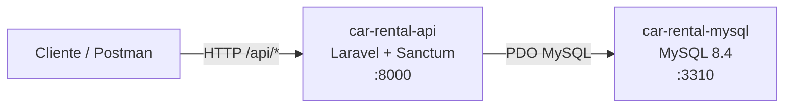
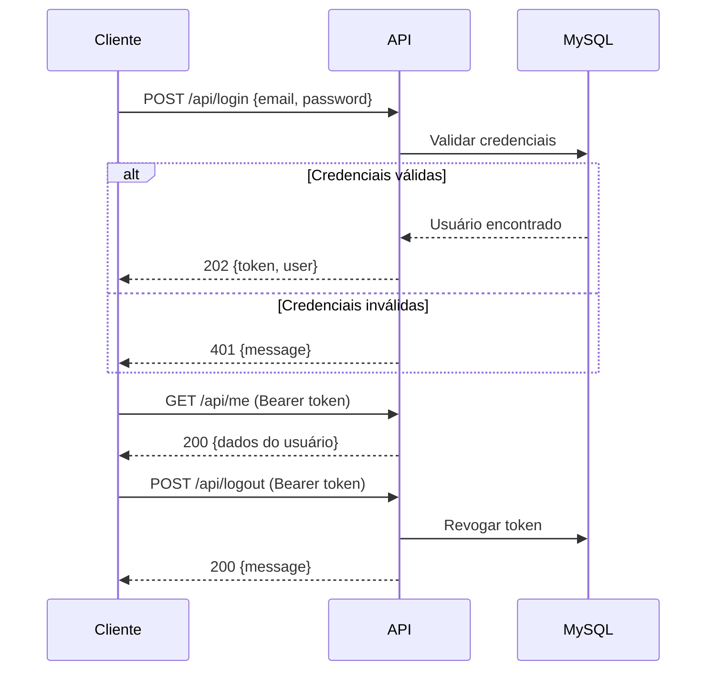
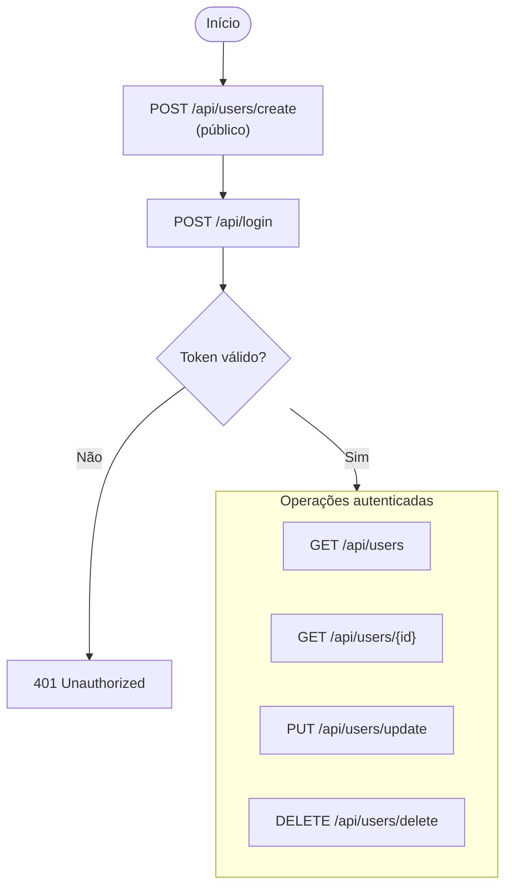
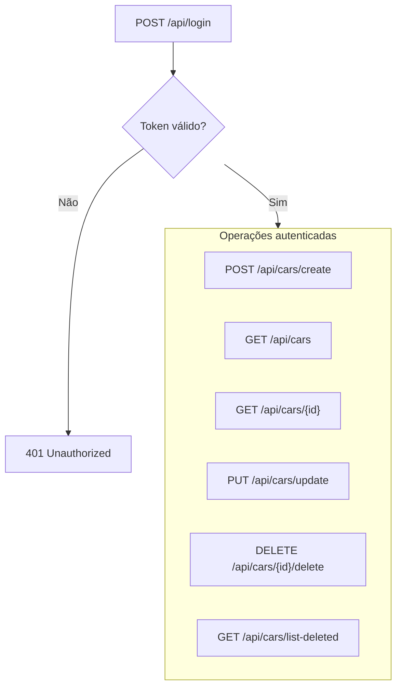

# Locadora Veicular — API

API REST para gerenciar usuários e carros de uma locadora veicular. Inclui autenticação via token (Laravel Sanctum), arquitetura hexagonal, DDD, princípios SOLID e testes automatizados.

**Stack:** PHP 8.3 · Laravel 10 · MySQL 8.4 · Docker

---

## Pré-requisitos

- [Docker](https://docs.docker.com/get-docker/) e Docker Compose
- Git

> No Windows, mantenha o **Docker Desktop** em execução antes de subir os containers.

---

## Subir o ambiente

### 1. Clonar o repositório

```bash
git clone git@github.com:brunojose13/Locadora-Veicular.git
cd Locadora-Veicular
```

### 2. Configurar variáveis de ambiente

```bash
cp .env.example .env
```

Preencha no `.env` as variáveis do banco:

```env
DB_CONNECTION=mysql
DB_HOST=car-rental-mysql
DB_PORT=3306
DB_DATABASE=car-rental
DB_DATABASE_TEST=test-car-rental
DB_USERNAME=seu_usuario
DB_PASSWORD=sua_senha
DB_ROOT_PASSWORD=sua_senha_root
```

| Variável | Uso |
|---|---|
| `DB_HOST=car-rental-mysql` | Nome do serviço MySQL no Docker (não altere ao usar containers) |
| `DB_DATABASE` | Banco principal — criado automaticamente pelo container |
| `DB_DATABASE_TEST` | Banco usado pelos testes automatizados |
| `DB_ROOT_PASSWORD` | Senha root do MySQL (usada pelo `docker-compose.yml`) |

### 3. Subir os containers

```bash
docker compose up -d --build
```

Isso sobe dois serviços:

| Serviço | Container | Porta |
|---|---|---|
| API (PHP + Artisan) | `car-rental-api` | `8000` |
| MySQL | `car-rental-mysql` | `3310` (host) → `3306` (container) |

O servidor da API inicia automaticamente (`php artisan serve`) ao subir o container.

### 4. Instalar dependências e gerar chave

```bash
docker compose exec car-rental-api composer install
docker compose exec car-rental-api php artisan key:generate
```

> Execute apenas na **primeira configuração** ou quando o `vendor/` não existir.

### 5. Executar migrations

```bash
docker compose exec car-rental-api php artisan migrate
```

### 6. Criar banco de testes

O container MySQL cria apenas o banco principal (`DB_DATABASE`). O banco de testes precisa ser criado manualmente:

```bash
docker compose exec car-rental-mysql mysql -u root -p"${DB_ROOT_PASSWORD}" \
  -e "CREATE DATABASE IF NOT EXISTS \`test-car-rental\`;"
```

> Substitua `test-car-rental` e a senha pelos valores definidos no seu `.env`.

### 7. (Opcional) Popular o banco

```bash
docker compose exec car-rental-api php artisan db:seed
```

Cria um usuário de teste e carros de exemplo:

| Campo | Valor |
|---|---|
| E-mail | `test@example.com` |
| Senha | `password` |

### 8. Verificar se a API está no ar

```bash
curl http://localhost:8000/
```

Resposta esperada:

```json
{ "message": "API is running" }
```

---

## Testar com Postman

O arquivo [`Car Rental API.postman_collection.json`](./Car%20Rental%20API.postman_collection.json) está na raiz do projeto para facilitar a importação local.

1. Abra o Postman → **Import** → selecione o arquivo JSON
2. Ajuste a variável de collection `url` para `http://localhost:8000`
3. Execute **Login** — o token é salvo automaticamente em `bearer_token`
4. As demais requisições autenticadas já utilizam esse token

> A collection também está disponível na nuvem: [Postman Collection](https://elements.getpostman.com/redirect?entityId=24702725-d04e8cf3-aa55-4d99-bcb8-3c46c56bb91b&entityType=collection)

---

## Testes automatizados

```bash
docker compose exec car-rental-api php artisan test
```

---

## Comandos úteis

```bash
# Ver logs da API
docker compose logs -f car-rental-api

# Executar qualquer comando Artisan
docker compose exec car-rental-api php artisan <comando>

# Parar e remover containers
docker compose down

# Limpar cache de configuração (útil após alterar .env)
docker compose exec car-rental-api php artisan config:clear
```

---

## Arquitetura



---

## Fluxos da API

Todas as rotas da API estão sob o prefixo `/api`. Requisições autenticadas exigem o header:

```
Authorization: Bearer {token}
```

O token expira em **10 minutos** por padrão (configurável via `AUTH_TOKEN_EXPIRATION_MINUTES`).

### Autenticação



### Usuários



| Método | Rota | Auth | Descrição |
|---|---|---|---|
| `POST` | `/api/users/create` | Não | Cadastrar usuário |
| `GET` | `/api/users` | Sim | Listar usuários |
| `GET` | `/api/users/{id}` | Sim | Buscar usuário por ID |
| `PUT` | `/api/users/update` | Sim | Atualizar usuário autenticado |
| `DELETE` | `/api/users/delete` | Sim | Remover usuário autenticado |

### Carros



| Método | Rota | Descrição |
|---|---|---|
| `POST` | `/api/cars/create` | Cadastrar carro |
| `GET` | `/api/cars` | Listar carros ativos |
| `GET` | `/api/cars/{id}` | Buscar carro por ID |
| `PUT` | `/api/cars/update` | Atualizar carro |
| `DELETE` | `/api/cars/{id}/delete` | Soft delete do carro |
| `GET` | `/api/cars/list-deleted` | Listar carros removidos |

---

## Resolução de problemas

**Erro de conexão com o banco (`SQLSTATE[HY000] [2002]`)**

- Confirme que `DB_HOST=car-rental-mysql` ao rodar via Docker
- Aguarde o healthcheck do MySQL antes de executar migrations
- Limpe o cache: `docker compose exec car-rental-api php artisan config:clear`

**Porta 8000 já em uso**

```bash
docker compose down
docker compose up -d
```

**Rodar PHP localmente (sem Docker)**

Comente `DB_HOST` no `.env` e conecte em `127.0.0.1:3310` (porta exposta do MySQL no host).
